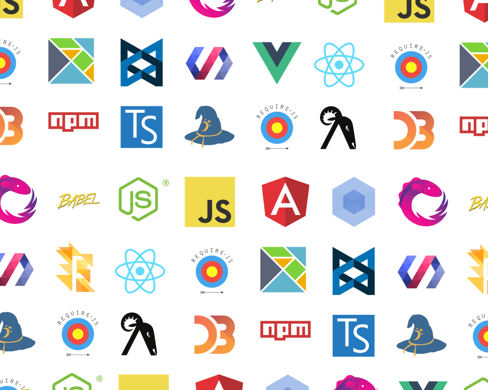

<!-- $size: 16:9 -->

# React

## Overview of useful tools

### For getting started

###### With very simple Hello World App

---
<!-- page_number: true -->

## How it feels to learn JavaScript in 2016



https://hackernoon.com/how-it-feels-to-learn-javascript-in-2016-d3a717dd577f

---

# React

- <https://facebook.github.io/react/>
- A javascript library for building user interfaces
- Renders DOM elements from components
- Handles components state 

---

## Template on server

```html
<!doctype html>
<html lang="en">
    <head>
        <meta charset="utf-8">
        <title>React App</title>
        <script src="react.js"></script>
        <script src="react-dom.js"></script>
    </head>
    <body>
        <div id="root">

        </div>
        <script src="hello-world.js"></script>
    </body>
</html>
```

---

## Template on client (rendered)

```html
<!doctype html>
<html lang="en">
    <head>
        <meta charset="utf-8">
        <title>React App</title>
        <script src="react.js"></script>
        <script src="react-dom.js"></script>
    </head>
    <body>
        <div id="root">
            <div data-reactroot="">Hello World</div>
        </div>
        <script src="hello-world.js"></script>
    </body>
</html>
```

---

## Javascript code - hello-world.js

```javascript
var HelloMessage = React.createClass({
  render: function() {
    return React.createElement(
      "div",
      null,
      "Hello World"
    );
  }
});

ReactDOM.render(
    React.createElement(HelloMessage),
    document.getElementById('root')
);
```

---

# ECMAScript

- <http://www.ecma-international.org/publications/standards/Ecma-262.htm>
- trademarked scripting-language specification
- standardized by Ecma International
- ECMA-262 and ISO/IEC 16262
- Based on JavaScript, which now tracks ECMAScript
- Other implementations include:
    - JScript (Internet Explorer)
    - ActionScript (Adobe Flash Player)

---

## ECMAScript current versions

- ES5 (December 2009)
    - Well supported in most modern browsers (since IE9)
- ES2015 (ES6) (June 2015)
    - Browser support is still incomplete
    - IE11 is not supported
- ES2016+ (ES7) (June 2016)
    - Currently under development in browsers
- ES8
    - Draft version
- <http://kangax.github.io/compat-table/>

---

## JS in ES5 - hello-world.js

```javascript
var HelloMessage = React.createClass({
    render: function () {
        return React.createElement(
            "div",
            null,
            "Hello World"
        );
    }
});

ReactDOM.render(
    React.createElement(HelloMessage),
    document.getElementById('root')
);
```

---

## JS in ES2015 - hello-world-es6.js

```javascript
class HelloMessage extends React.Component {
    render() {
        return React.createElement(
            "div",
            null,
            "Hello World"
        );
    }
}

ReactDOM.render(
    React.createElement(HelloMessage),
    document.getElementById('root')
);
```

---

## JS in ES2015 with JSX - hello-world-jsx.js

```javascript
class HelloMessage extends React.Component {
    render() {
        return (
            <div>Hello World</div>
        );
    }
}

ReactDOM.render(
    React.createElement(HelloMessage),
    document.getElementById('root')
);
```

---

# JSX

- <https://facebook.github.io/jsx/>
- XML-like syntax extension to ECMAScript (syntactic sugar)
- Extends the PrimaryExpression in ES2015 (ES6)
- NOT a proposal to incorporate JSX into the ECMAScript
- Intended to be used by preprocessors (transpilers)

---

# Transpiler (Source-to-source compiler)

- <https://en.wikipedia.org/wiki/Source-to-source_compiler>
- Type of compiler
- Takes the source code written in one programming language
- Produces the equivalent source code in another programming language
- Both programming languages operate at approximately the same level of abstraction
- Examples: CoffeeScript, TypeScript, Babel, ELM

---

# Babel

- <https://babeljs.io/>
- JavaScript compiler
- Transforms ES2015 syntax to ES5
- Can include polyfill
- Can convert JSX and strips out Flow types
- Pluggable
- Debuggable (source maps)

---

# Polyfill

- <https://en.wikipedia.org/wiki/Polyfill>
- Code that implements a feature on web browsers that do *not* support the feature
- For example can add support for:
    - HTML5
    - CSS3
    - Promises (<https://www.promisejs.org/>)
    - Async/await

---

## Callback hell example

```javascript
function handler(request, response) {
    User.get(request.user, function (err, user) {
        if (err) {
            response.send(err);
        } else {
            Notebook.get(user.notebook, function (err, notebook) {
                if (err) {
                    return response.send(err);
                } else {
                    doSomethingAsync(user, notebook, function (err, result) {
                        if (err) {
                            response.send(err)
                        } else {
                            response.send(result);
                        }
                    });
                }
            });
        }
    })
}
```

---

## With promises

```javascript
function handler(request, response) {
    var user, notebook;
    User.get(request.user)
        .then(function (aUser) {
            user = aUser;
            return Notebook.get(user.notebook);
        })
        .then(function (aNotebook) {
            notebook = aNotebook;
            return doSomethingAsync(user, notebook);
        })
        .then(function (result) {
            response.send(result)
        })
        .catch(function (err) {
            response.send(err)
        })
}
```

---

## With async/await

```javascript
async function handler(request, response) {
    try {
        var user = await User.get(request.user);
        var notebook = await Notebook.get(user.notebook);
        var result = await doSomethingAsync(user, notebook);
        response.send(result);
    } catch (err) {
        response.send(err);
    }
}
```

---

# Flow

- <https://flowtype.org/>
- Static type checker for javascript
- Command line tool
- Uses type inference to find bugs even without type annotations
- You can add type assertions to your JavaScript code
-

---

## Basic Flow example

Input

```javascript
// @flow
function foo(x) {
    return x * 10;
}
foo('Hello, world!');
```

Output

```text
3:   return x * 10;
            ^ string. The operand of an arithmetic operation must be a number.
```

---

## Flow with type assertion example

Input

```javascript
// @flow
function bar(x): string {
    return x.length;
}
bar('Hello, world!');
```

Output

```text
3:  return x.length;
           ^^^^^^^^ number. This type is incompatible with the expected return type of
2: function bar(x): string {
                    ^^^^^^ string
```

---

# ESLint

- <http://eslint.org/>
- The pluggable linting utility for JavaScript and JSX
- Static code analysis tool

Input

```javascript
var foo = bar;
```

Output

```bash
  23:5   error  'foo' is assigned a value but never used  no-unused-vars
  23:11  error  'bar' is not defined                      no-undef

✖ 2 problems (2 errors, 0 warnings)
```

---

# We talked about Babel

## How can I run it?

---

# Prerequisites

## Node.js

- <https://nodejs.org>
- JavaScript runtime built on Chrome's V8 JavaScript engine

## NPM

- Package manager for JavaScript

---

## Back to Hello World example

Installation of Babel cli version

```bash
npm install babel-cli babel-preset-es2015 babel-preset-react
```

Compile files

```bash
babel --presets=es2015,react hello-world-jsx.js --out-file hello-world-jsx-compiled.js
```

---

# Bundler

- Putting source files and libraries together
- Can combine JavaScript, css, images, ...
- Example tools for bundling:
    - Webpack
    - Browserify
    - jspm
    - Rollup

---

# Webpack

- <https://webpack.github.io/>
- Can use configuration with loaders and plugins (e.g. Babel)
- Different optimizations for development and production
- Can include source maps (useful for debugging)
- Can uglify output (minimize bundle size)

---

## Installing Webpack

With package.json

```json
{
  "private": true,
  "dependencies": {
    "react": "^15.4.2",
    "react-dom": "^15.4.2"
  },
  "devDependencies": {
    "babel-core": "^6.23.1",
    "babel-loader": "^6.3.0",
    "babel-preset-es2015": "^6.22.0",
    "babel-preset-react": "^6.23.0",
    "webpack": "^2.2.1"
  }
}
```

You can run just `npm install`

---

## Running Webpack

Example without configuration file:

```bash
webpack index=./src/index.js --output-path='./static' --output-filename='bundle.js'
```

With configuration file you can run just:
- `webpack -d` for development version
- `webpack -p` for production version

---

# Static analysis

## ESLint

- Needs config file `.eslint.rc.js`

```bash
eslint src/
```

## Flow

- Needs config file `.flowconfig`
- `// @flow` on the top of file indicates that this file will be checked

```bash
flow check
```

---

# Create React App

- <https://github.com/facebookincubator/create-react-app>
- Create React apps with no build configuration

Installation

```bash
npm install -g create-react-app
```

Usage

```bash
create-react-app my-app
cd my-app/
npm start
```

---

# Extras

## Frontend-maven-plugin

- <https://github.com/eirslett/frontend-maven-plugin>
- Keeps frontend and backend builds as separate as possible
- Downloads/installs Node and NPM locally for your project
- Runs `npm install`
- Runs Webpack

---

```xml
<?xml version="1.0" encoding="UTF-8"?>
<project ...>
    ...
    <build>
        ...
        <plugins>
            ...
            <plugin>
                <groupId>com.github.eirslett</groupId>
                <artifactId>frontend-maven-plugin</artifactId>
                <version>1.3</version>
                <configuration>
                    <installDirectory>target</installDirectory>
                </configuration>
                <executions>
                    ...
                </executions>
            </plugin>
            ...
        </plugins>
        ...
    </build>
    ...
</project>
```

---

```xml
<execution>
    <id>install node and npm</id>
    <goals>
        <goal>install-node-and-npm</goal>
    </goals>
    <configuration>
        <nodeVersion>v6.9.5</nodeVersion>
        <npmVersion>4.1.2</npmVersion>
    </configuration>
</execution>
<execution>
    <id>npm install</id>
    <goals>
        <goal>npm</goal>
    </goals>
    <configuration>
        <arguments>install</arguments>
    </configuration>
</execution>
<execution>
    <id>webpack build</id>
    <goals>
        <goal>webpack</goal>
    </goals>
</execution>
```

---

# Questions?

---

# What's next?

- Router
- Flux
- Redux
- Generators (function*)
- ...


